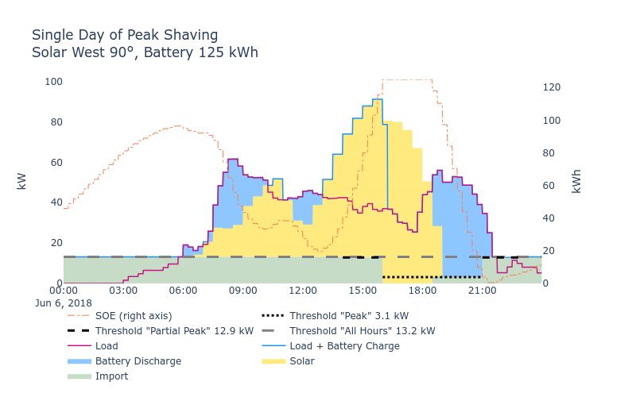

# Peak Shaving with Vertical Bifacial Solar



# Quickstart

1. Set up the environment using conda (download it if you dont have it)
```bash
conda create --name bps python=3.11
conda activate bps
pip install -r requirements.txt
```

2. Edit the config file for your machine (rename if you like), making the data directories correct

3. Run in an editor or terminal with

```bash
python bifacial_peak_shaving.py
```

# Config file

The code works best if you only ever use forward slashes in paths (e.g. "/").

In addition, like any .json file, it's important to follow the .json format:
- Remember double quotes for strings
- Comma after every entry (e.g. "key":[value],)
- Square brackets for lists
- Booleans are "false" or "true" (but no quotes)
- No duplicate keys
- No comments

